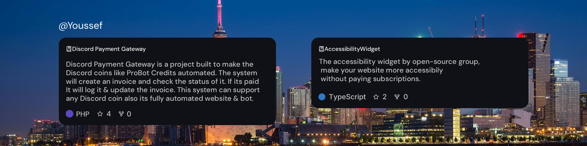

<!-- Terminal-style GitHub README -->

<div align="center">
   <h1>Hey, My name Youssef</h1>
    
  
  
  <br>
  

  <br><br>

</div>


```shell
> whoami
⚡ Youssef — Full-stack Developer | Systems Architecture & Automation | Startup Builder
```

```shell
> tech-stack --list
🧠 Languages:        C# | Python | JavaScript | PHP | HTML | CSS | Lua | Sql
🧩 Frameworks:       React | TailwindCSS | Node.js | Svelte | Electron
📦 Databases:        MongoDB | SupaBase | PostgreSQL 
🤖 Discord Tech:     discord.py | discord.js | discord-selfbot | DiscordSDK
💳 Payments:         PayPal | Zbooni
🧰 Tools:            Git | VS Code | Figma | AWS | Blender
```

```shell
> status --now
🚧 Currently learning Golang, Large Scalability & Load Balancing.
⭐ I have fun building 3d objects & Gta MLOs in my free time.
🎮 Gaming in spare time: GTA V, Arc Raiders, CS2.
```
---

<div align="center">
  
  <br><br>
  
  <sub>“Credit: TerminalKyle”</sub>
</div>
